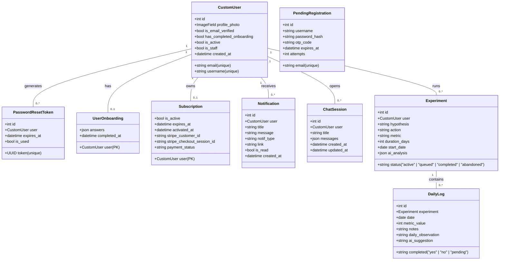

# 🚀 Comprehensive Project Analysis: Do What Works (A to Z)

An exhaustive technical, architectural, and structural evaluation of the **Do What Works** platform—a behavioral science-driven SaaS ecosystem designed to refine subjective beliefs into testable, quantitative self-experiments.

---

## 🧭 1. Architectural & Conceptual Design

### Behavioral Science Philosophy
The core purpose of **Do What Works** is to move users from passive habit tracking to active scientific validation of their life assumptions. The journey flows through four phases:
1. **The Dig (Onboarding)**: Auditing subjective beliefs across 11 cognitive dimensions.
2. **The Lab (Brainstorming)**: Conversing with "Daniel" (the AI Strategist) to formulate a concrete, falsifiable hypothesis.
3. **The Protocol (Execution)**: A structured sprint (typically 10 days) of daily logging enforcing strict adherence and metric scoring.
4. **The Verdict (Analysis)**: Processing the gathered evidence through an LLM to determine if the hypothesis is **Validated** or **Falsified**, generating actionable suggestions.

### High-Level Architecture
The platform is built as a fully decoupled, modern web application:
- **Frontend**: A React 19 + Vite 6 + TypeScript application styled with Tailwind CSS 4 and animated via Framer Motion. It acts as an interactive client displaying states managed by React Contexts and querying the backend via Axios with automatic JWT refresh intercepts.
- **Backend**: A Django 4.2 REST API using Django REST Framework (DRF) and SimpleJWT. It exposes structured JSON endpoints, handles token-based auth, manages database state, registers webhooks, and connects to external integrations.
- **Integrations**:
  - **Stripe**: Manages subscription-based gatekeeping (10-day sprints).
  - **n8n Webhook Hub**: Delegated tasks like user onboarding sync, session chat generation, daily tactical adjustments, and final experimental verdict analyses.

---

## 🗄️ 2. Backend Database Schema (A to Z)

The database schema is designed for SQLite in development and is PostgreSQL-ready. The models are divided between the `accounts` and `experiments` applications:



### Model Specifications

#### `accounts` Models
1. **`CustomUser`** (`accounts.CustomUser`):
   - Extends `AbstractBaseUser` and `PermissionsMixin`.
   - `email` (EmailField, unique): User's identifier.
   - `username` (CharField, max_length=30, unique).
   - `profile_photo` (ImageField, uploads to `profile_photos/`, nullable).
   - `is_email_verified` (BooleanField, default=False).
   - `has_completed_onboarding` (BooleanField, default=False).
   - `is_active` / `is_staff` (BooleanFields for admin management).
   - Managed by `CustomUserManager` normalized by email.

2. **`PendingRegistration`**:
   - Implements deferred registration to prevent unverified registration entries in the `CustomUser` table.
   - `email` (EmailField, unique), `username` (CharField), `password_hash` (CharField).
   - `otp_code` (CharField, max_length=6): Verification OTP.
   - `expires_at` (DateTimeField): 10 minutes expiry.
   - `attempts` (IntegerField, default=0): Caps invalid verification attempts at 5.

3. **`PasswordResetToken`**:
   - `user` (ForeignKey, `CustomUser`).
   - `token` (UUIDField, default=uuid.uuid4, unique).
   - `expires_at` (DateTimeField): 1 hour expiry.
   - `is_used` (BooleanField, default=False).

4. **`UserOnboarding`**:
   - Linked to `CustomUser` via `OneToOneField` (acts as primary key).
   - `answers` (JSONField): Key-value dictionary storing onboarding questionnaire answers.

5. **`Subscription`**:
   - Linked to `CustomUser` via `OneToOneField` (acts as primary key).
   - `is_active` (BooleanField, default=False).
   - `activated_at` / `expires_at` (DateTimeFields).
   - `stripe_customer_id` / `stripe_checkout_session_id` (CharFields).
   - `payment_status` (CharField: `pending`, `paid`, `failed`).
   - Properties:
     - `days_remaining`: Calculated dynamically (using ceiling rounding).
     - `is_valid`: Verifies if `is_active` is True and the expiration date has not passed.

6. **`Notification`**:
   - `user` (ForeignKey, `CustomUser`).
   - `title` (CharField), `message` (TextField).
   - `notif_type` (CharField: `experiment_finished`, `ai_analysis_ready`, `system`, `subscription`).
   - `link` (CharField, nullable).
   - `is_read` (BooleanField, default=False).
   - Ordered by descending `created_at`.

#### `experiments` Models
1. **`ChatSession`**:
   - `user` (ForeignKey, `CustomUser`).
   - `title` (CharField, default='New Conversation').
   - `messages` (JSONField): Dynamic array storing chat histories.
   - Ordered by descending `updated_at` (most recent active chats first).

2. **`Experiment`**:
   - `user` (ForeignKey, `CustomUser`).
   - `hypothesis` (TextField), `action` (TextField).
   - `metric` (CharField): User-chosen quantitative parameter to track.
   - `duration_days` (PositiveIntegerField).
   - `start_date` (DateField, auto-assigned on creation).
   - `status` (CharField: `active`, `queued`, `completed`, `abandoned`).
   - `ai_analysis` (JSONField): Stores computed results (`pragmatic_score`, `verdict`, `analysis`, `recommendation`).

3. **`DailyLog`**:
   - `experiment` (ForeignKey, `Experiment`, related_name='logs').
   - `date` (DateField).
   - `completed` (CharField: `yes`, `no`, `pending`).
   - `metric_value` (PositiveSmallIntegerField, default=5, range 1-10 on frontend).
   - `notes` (TextField): Experiment-focused records.
   - `daily_observation` (TextField): Broad daily journal notes.
   - `ai_suggestion` (TextField, nullable): Daniel's daily recommendation.
   - Enforces `unique_together = ('experiment', 'date')` to guarantee one log per day per experiment.

---

## 📡 3. REST API Endpoint Route Map

The API operates under the version prefix `api/v1/` and contains the following routing systems:

### Authentication & Account Management (`api/v1/auth/`)
| Path | HTTP Method | View Class | Permission | Description |
|---|---|---|---|---|
| `signup/` | `POST` | `SignUpView` | `AllowAny` | Initiates signup, hashes password, saves `PendingRegistration`, sends OTP email. |
| `verify-otp/` | `POST` | `VerifyOTPView` | `AllowAny` | Validates OTP. Promotes pending registration to a full `CustomUser`. Returns JWT tokens. |
| `login/` | `POST` | `LoginView` | `AllowAny` | Standard login. Generates JWT access/refresh credentials. |
| `token/refresh/` | `POST` | `TokenRefreshView` | `AllowAny` | Refreshes expired JWT access tokens. |
| `forgot-password/` | `POST` | `ForgotPasswordView` | `AllowAny` | Generates secure UUID token and emails reset password URL. |
| `reset-password/` | `POST` | `ResetPasswordView` | `AllowAny` | Validates UUID token and overrides user password. |
| `profile/` | `GET`, `PATCH` | `ProfileView` | `IsAuthenticated` | Gets user profile or updates details (e.g. upload profile photos). |
| `onboarding/` | `GET`, `POST` | `OnboardingView` | `IsAuthenticated` | Saves or retrieves answers from the initial "The Dig" audit. |
| `subscription/` | `GET` | `SubscriptionView` | `IsAuthenticated` | Returns user subscription status and remaining active sprint days. |
| `subscription/activate/`| `POST` | `ActivateSubscriptionView` | `IsAuthenticated`| Manually starts a free 10-day testing sprint. |
| `stripe/create-checkout/`| `POST` | `CreateStripeCheckoutView`| `IsAuthenticated`| Sets up Stripe Customer/Checkout Session. Returns checkout redirect url. |
| `stripe/webhook/` | `POST` | `StripeWebhookView` | `AllowAny` | Processes completed stripe checkout session events to active subscription. |
| `notifications/` | `GET` | `NotificationViewSet` | `IsAuthenticated` | Paginated API view of user notification stack. |
| `notifications/<id>/mark_read/`| `PATCH` | `NotificationViewSet` | `IsAuthenticated` | Marks a specific notification as read. |
| `notifications/mark-all-read/` | `POST` | `NotificationViewSet` | `IsAuthenticated` | Marks all notifications for user as read. |

### Chats & Experiments (`api/v1/`)
| Path | HTTP Method | View Class | Permission | Description |
|---|---|---|---|---|
| `chat/sessions/` | `GET`, `POST` | `ChatSessionListCreateView` | `IsAuthenticated` | Retrieves chat lists or starts a new conversation session. |
| `chat/sessions/<id>/` | `GET`, `PATCH`, `DELETE` | `ChatSessionDetailView` | `IsAuthenticated` | Manages a specific session (changes title, reads history, deletes). |
| `chat/sessions/<id>/messages/` | `POST` | `ChatMessageListCreateView` | `IsAuthenticated` | Appends a message to the session's thread-safe message JSON array. |
| `experiments/` | `GET`, `POST` | `ExperimentListCreateView` | `IsAuthenticated` | Gets experiments list or launches a new experiment. |
| `experiments/<id>/` | `GET`, `PATCH`, `DELETE`| `ExperimentDetailView` | `IsAuthenticated` | Manages experiment states (completing, abandoning, or deleting). |
| `experiments/<id>/logs/` | `GET`, `POST` | `DailyLogView` | `IsAuthenticated` | Fetches daily logs or upserts a new log for the current calendar date. |
| `experiments/<id>/analyze/` | `POST` | `ExperimentAnalyzeView` | `IsAuthenticated` | Manages the n8n analysis webhook to process completed logs. |
| `experiments/<id>/generate-daily-action/`| `POST` | `ExperimentDailyActionView`| `IsAuthenticated`| Triggers the daily pivot action webhook to update today's log. |

---

## ⚡ 4. Django Application Logic & Services

### Deferred Registration System
To prevent database bloating by spam accounts, signups do not immediately insert records into the `CustomUser` model. Instead, details are cached in `PendingRegistration`. When a matching OTP is verified inside the validity window (10 min) and below maximum retry limits, a transaction builds the user:
```python
user = CustomUser.objects.create(
    email=pending.email,
    username=pending.username,
    is_email_verified=True,
)
user.password = pending.password_hash
user.save()
pending.delete()
```

### Stripe Webhook Receiver
When a customer pays on the Stripe Hosted Checkout page, Stripe dispatches a webhook to the backend:
1. `StripeWebhookView` checks signature authenticity using `STRIPE_WEBHOOK_SECRET`.
2. On `checkout.session.completed`, it extracts the `user_id` stored in session metadata.
3. Retrieves the database `Subscription` record and updates parameters:
   ```python
   sub.is_active = True
   sub.payment_status = 'paid'
   sub.stripe_customer_id = getattr(session, 'customer', None)
   sub.activated_at = timezone.now()
   sub.expires_at = timezone.now() + timedelta(days=10)
   sub.save()
   ```

### Webhook Automations Handler (`backend/experiments/services.py`)
- **`trigger_ai_analysis(experiment)`**:
  - Compiles the experiment hypothesis, actions, metrics, and all related `DailyLog` objects.
  - Submits a POST request to `ANALYSIS_WEBHOOK_URL` on n8n.
  - Resolves n8n structure responses. If it contains a `pragmatic_score`, it updates `experiment.ai_analysis` and posts a system notification (`Strategist Insight Ready`).
- **`trigger_daily_action(experiment, log)`**:
  - Submits the experiment meta-data alongside historical log trends to `DAILY_ACTION_WEBHOOK_URL`.
  - Parses returning payloads (including processing raw JSON structures nested in markdown code blocks) to extract recommendations.
  - Updates `log.ai_suggestion` fields.

### Auto-Succession Logic (`backend/experiments/signals.py`)
To maintain engagement, a database signal triggers whenever an experiment moves to a terminal state (`completed` or `abandoned`):
- If the user does not have an active experiment, the signal queries for the oldest `queued` experiment.
- If one exists, it changes its status to `active` and assigns its `start_date` to today's date.
```python
@receiver(post_save, sender=Experiment)
def handle_experiment_succession(sender, instance, created, **kwargs):
    if instance.status in ['completed', 'abandoned']:
        user = instance.user
        has_active = Experiment.objects.filter(user=user, status='active').exists()
        if not has_active:
            next_queued = Experiment.objects.filter(user=user, status='queued').order_by('created_at').first()
            if next_queued:
                next_queued.status = 'active'
                next_queued.start_date = timezone.now().date()
                next_queued.save()
```

---

## 💻 5. Frontend Architecture (React + Vite + TS)

The frontend features a responsive layout utilizing dark aesthetics with glassmorphic panels and orange accents (`#C75F33`).

### 1. State Management (React Contexts)
State is distributed across several contexts located in `frontend/src/components/`:
- **`AuthContext`**: Manages user authentication, checks token presence, saves/removes profile states from localStorage, and coordinates requests to `/auth/profile/` and `/auth/onboarding/`.
- **`AccessContext`**: Wraps billing logic. Computes `isSubscribed` based on remaining days.
- **`ChatContext`**: Provides states for brainstorming with Daniel. Manages optimistic state updates. When a message is sent:
  1. A temporary message object is immediately rendered in the UI with a temporary ID.
  2. The server request resolves to `/api/v1/chat/sessions/<id>/messages/`.
  3. The local state replaces the temporary ID with the confirmed DB ID.
- **`ExperimentContext`**: Stores active and historical experiments. Re-fetches the full list of experiments after a new daily log submission to align succession signals.
- **`NotificationContext`**: Pulls updates from `/api/v1/auth/notifications/` and offers helpers to mark items as read.

### 2. Routes & Guarding (`App.tsx`)
Routes are configured in `App.tsx` and protected by two router layers:
- **`PublicRoute`**: Redirects logged-in users away from authentication pages (`/login`, `/signup`, `/`) to `/overview`.
- **`PrivateRoute`**: Redirects unauthenticated sessions to `/login`. It also monitors onboarding progress: if a user is authenticated but has not completed "The Dig", they are redirected to `/onboarding`.

### 3. Application Pages (`frontend/src/pages/`)
- **`LandingPage.tsx`**: High-conversion landing page detailing features, pricing, and system concepts.
- **`Onboarding.tsx`**: Conducts "The Dig". Features an 11-step sidebar questionnaire rating behaviors from "Strongly Disagree" to "Strongly Agree".
- **`Daniel.tsx`**: The core AI brainstorm interface. Connects directly to the chat webhook. If the webhook response details a formatted hypothesis, action, metric, and duration, the page renders a call-to-action button:
  ```typescript
  const parseExperimentData = (text: string) => {
    const findVal = (label: string) => { ... }
    const hypothesis = findVal('Hypothesis');
    const action = findVal('Action');
    const metric = findVal('Metric');
    const duration = findVal('Duration');
    if (hypothesis && action && metric && duration) {
      return { hypothesis, action, metric, duration };
    }
  };
  ```
  Clicking "Convert to Experiment" passes the parsed data via React Router state to the Experiment Wizard.
- **`Experiment.tsx`**: The creation wizard. Populates fields from Daniel's recommendations, allowing edits before launching the experiment.
- **`Overview.tsx`**: The main user dashboard. Displays statistics, performance progress over the last 10 logs using an Area Chart, onboarding beliefs using a Radar Chart, active status progress bars, and recent AI recommendations.
- **`DailyLog.tsx`**: Daily tracking log. Requires users to trigger Daniel's daily pivot action first, then records observations, completion status, metric scores (1-10 slider), and custom notes.
- **`Result.tsx`**: Displays all active, queued, completed, and abandoned experiments.
- **`ExperimentDetails.tsx`**: Details a single experiment. Computes streaks and logs completion rates, rendering SVG metric charts and markdown AI verdicts.
- **`Profile.tsx` / `Preferences.tsx`**: Handles profile configurations (uploading photos) and reviews onboarding survey scores.

---

## 🔗 6. Systems Integrations

### Stripe Integration Workflow
The payment system maps a 10-day sprint usage structure:

```
[Frontend: Click Unlock] 
          │
          ▼
[POST: api/v1/auth/stripe/create-checkout/]
          │
          ▼
[Django View: Create Customer & stripe.checkout.Session]
          │
          ▼
[Frontend: Redirect to checkout.stripe.com]
          │
          ▼
[User Completes Payment & Redirects to /success]
          │
          ▼ (Asynchronous Webhook Call)
[Stripe Webhook API -> api/v1/auth/stripe/webhook/]
          │
          ▲ (Checks signature & updates DB Subscription state)
```

### n8n Integrations
The application coordinates three separate n8n workflows:
1. **Onboarding Sync Webhook**: Dispatched client-side when completing "The Dig" questionnaire to process context vectors.
2. **Daniel Chat Webhook**: Handles the chat history payload to respond to users with structured experiment proposals.
3. **Daily Action Webhook**: Processes the current experiment state to generate today's actionable task.
4. **Analysis Webhook**: Evaluates completed experiment logs to return a pragmatic score (1-10), a verdict (Validated/Falsified), analysis findings, and a final strategic recommendation.

---

## 🛠️ 7. Environment & Deployment Setup

### Local Development Env Configuration (`.env`)
- **`DEBUG`**: Set to `True` for diagnostic reports.
- **`SECRET_KEY`**: Backend security token.
- **`DATABASE_URL`**: DB URI (defaults to SQLite: `sqlite:///db.sqlite3`).
- **`EMAIL_HOST_USER` / `EMAIL_HOST_PASSWORD`**: Gmail credentials for SMTP routing.
- **`STRIPE_SECRET_KEY` / `STRIPE_PUBLISHABLE_KEY` / `STRIPE_WEBHOOK_SECRET`**: API keys for billing logic.
- **`ANALYSIS_WEBHOOK_URL` / `DAILY_ACTION_WEBHOOK_URL`**: Webhooks for backend integrations.

### Static File Management & Server Settings
In production, Django is configured to serve static files efficiently through **WhiteNoise**:
- `MIDDLEWARE` contains `whitenoise.middleware.WhiteNoiseMiddleware` right after the security middleware.
- `STATICFILES_STORAGE` uses `whitenoise.storage.CompressedManifestStaticFilesStorage`, which compresses assets and handles caching headers.
- SSL redirects and security headers (`SECURE_SSL_REDIRECT`, `SESSION_COOKIE_SECURE`, `CSRF_COOKIE_SECURE`) are toggled via environment configurations to prevent session hijacking.
- Django leverages `gunicorn` inside docker setups for multi-process HTTP handling.

### Docker Environment Specifications
The codebase features a production-ready containerization blueprint:
- **`Dockerfile`**: A multi-stage setup utilizing `python:3.10-slim`. It sets environment variables, installs system build tools, installs `requirements.txt`, copies backend resources, runs `collectstatic`, and runs the entrypoint script.
- **`entrypoint.sh`**: Executed on startup inside containers. Performs database migrations automatically:
  ```bash
  python manage.py migrate --noinput
  python manage.py collectstatic --noinput
  exec "$@"
  ```
- **`docker-compose.yml`**: Spins up the backend service, exposes port 8000, mounts the SQLite file, and maps environment configuration files.

---

## 📈 8. Architectural Assessment & Future Roadmap

After a detailed code review, the following development recommendations are suggested to improve the platform's stability and scalability:

1. **Backend LLM Integration**: 
   Currently, Daniel's chat is called directly from the frontend to an n8n webhook. Transitioning this logic through a backend endpoint (e.g., `/api/v1/chat/message/`) would centralize authentication, secure integration keys, and allow DB-backed transaction records to load reliably.
2. **Asynchronous Webhook Calls**: 
   The endpoints `/analyze/` and `/generate-daily-action/` request n8n synchronously, blocking DB transactions for up to 30 seconds. Implementing a queue broker (like Celery or Redis) would execute these tasks in the background, updating logs through callbacks.
3. **Database Migration to PostgreSQL**: 
   Moving to PostgreSQL for production is recommended, as concurrent JSON updates on SQLite database files can cause transaction locks.
4. **Enhanced Data Security**: 
   The Stripe webhook currently assumes user-supplied IDs from metadata are valid. Adding digital signatures or retrieving status sessions directly from the Stripe API would improve payment verification security.
