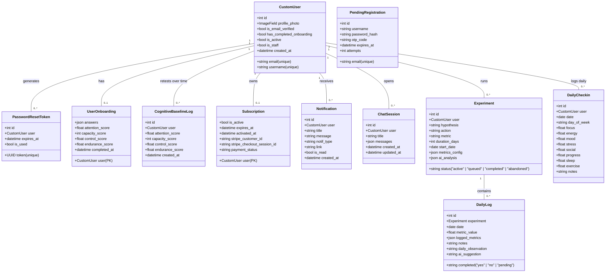

# 🚀 Comprehensive Project Analysis: Do What Works (A to Z)

An exhaustive technical, architectural, and structural evaluation of the **Do What Works** platform—a behavioral science-driven SaaS ecosystem designed to refine subjective beliefs into testable, quantitative self-experiments.

*Last synced against commit `1127f15` ("Inject onboarding profile and attention baseline into Daniel chat webhook payload").*

---

## 🧭 1. Architectural & Conceptual Design

### Behavioral Science Philosophy
The core purpose of **Do What Works** is to move users from passive habit tracking to active scientific validation of their life assumptions. The journey flows through four phases:
1. **The Dig (Onboarding)**: Auditing subjective beliefs across 11 cognitive dimensions, plus an optional 2-minute **Attention Baseline Battery** (three mini cognitive-science games) that produces objective capacity/control/endurance scores.
2. **The Lab (Brainstorming)**: Conversing with "Daniel" (the AI Strategist) — now primed with the user's onboarding profile, cognitive baseline history, and recent daily check-ins — to formulate a concrete, falsifiable hypothesis.
3. **The Protocol (Execution)**: A structured sprint (typically 10 days, or template-defined) of daily logging enforcing strict adherence and per-metric scoring, plus a separate, always-on **Daily Metrics Check-in** (sleep/energy/mood/stress/etc.) independent of any active experiment.
4. **The Verdict (Analysis)**: Processing the gathered evidence (logs + cognitive history + check-in history) through an LLM to determine if the hypothesis is **Validated** or **Falsified**, generating actionable suggestions.

### High-Level Architecture
The platform is built as a fully decoupled, modern web application:
- **Frontend**: A React 19 + Vite 6 + TypeScript application styled with Tailwind CSS 4 and animated via Framer Motion. It acts as an interactive client displaying states managed by React Contexts and querying the backend via Axios with automatic JWT refresh intercepts. Charts via Recharts (Area/Radar/Bar/Line).
- **Backend**: A Django 4.2 REST API using Django REST Framework (DRF) and SimpleJWT. It exposes structured JSON endpoints, handles token-based auth, manages database state, registers webhooks, and connects to external integrations.
- **Integrations**:
  - **Stripe**: Manages subscription-based gatekeeping (10-day sprints).
  - **n8n Webhook Hub**: Delegated tasks for onboarding/baseline sync, session chat generation, daily tactical adjustments, and final experimental verdict analyses — all now enriched with cognitive-history and check-in context so the AI "remembers" the user across sessions.

---

## 🗄️ 2. Backend Database Schema (A to Z)



### Model Specifications

#### `accounts` Models
1. **`CustomUser`**: Extends `AbstractBaseUser` + `PermissionsMixin`; email is the `USERNAME_FIELD`. Managed by `CustomUserManager`.
2. **`PendingRegistration`**: Deferred registration cache (10-min OTP expiry, capped at 5 attempts) to avoid ghost accounts.
3. **`PasswordResetToken`**: UUID token, 1-hour expiry, `is_used` flag.
4. **`UserOnboarding`**: One row per user. Stores the 11-dimension belief `answers` JSON **plus** the latest cognitive baseline (`attention_score`, `capacity_score`, `control_score`, `endurance_score`) — i.e. it now doubles as the "current snapshot" of both the qualitative and objective self-assessment.
5. **`CognitiveBaselineLog`** *(new)*: An append-only time series of every Attention Battery attempt (a user can retake it), ordered by `created_at`. This is what powers the "progression chart" on the Overview dashboard and the `cognitive_history` sent to the AI. `UserOnboarding` always holds the latest values; this table holds the full history.
6. **`Subscription`**: 10-day sprint gate. `days_remaining` (ceil-rounded) and `is_valid` computed properties. Stripe fields (`stripe_customer_id`, `stripe_checkout_session_id`, `payment_status`) support the real checkout flow described in `implementation_plan.md`.
7. **`Notification`**: Typed (`experiment_finished`, `ai_analysis_ready`, `system`, `subscription`), ordered newest-first.

#### `experiments` Models
1. **`ChatSession`**: `messages` JSONField holds the full chat array (no separate `ChatMessage` table — append-only updates).
2. **`Experiment`**: Added `metrics_config` (JSON) — a structured definition of *what* gets tracked daily beyond the single headline `metric` (see Template System below). Still has the four-state lifecycle (`active`/`queued`/`completed`/`abandoned`) with auto-succession (see §4).
3. **`DailyLog`**: `metric_value` is now a `FloatField` (was integer) supporting decimal scores (client-feedback-driven change), and a new `logged_metrics` JSONField stores per-metric values matching the experiment's `metrics_config` schema — so a single day's log can record several distinct numeric/boolean readings, not just one score. `unique_together = ('experiment', 'date')` still guarantees one log per day.
4. **`DailyCheckin`** *(new)*: A **global, experiment-independent** daily pulse-check — `focus`, `energy`, `mood`, `stress`, `social`, `progress`, `sleep`, `exercise` (all 1–10, decimal-capable on the frontend slider) plus free-text `notes`. One row per user per calendar date (`unique_together = ('user', 'date')`). This exists independently of whether the user has an active experiment, and feeds both the Overview dashboard and every AI webhook payload as ambient context.

---

## 📡 3. REST API Endpoint Route Map

`api/v1/` prefix throughout.

### Authentication & Account Management (`api/v1/auth/`)
| Path | Method | View | Permission | Description |
|---|---|---|---|---|
| `signup/` | POST | `SignUpView` | AllowAny | Hashes password, creates `PendingRegistration`, emails OTP. |
| `verify-otp/` | POST | `VerifyOTPView` | AllowAny | Validates OTP → promotes to `CustomUser`, returns JWT. |
| `login/` | POST | `LoginView` | AllowAny | JWT access/refresh. |
| `token/refresh/` | POST | `TokenRefreshView` | AllowAny | Refreshes JWT. |
| `forgot-password/` | POST | `ForgotPasswordView` | AllowAny | UUID reset token email. |
| `reset-password/` | POST | `ResetPasswordView` | AllowAny | Validates token, overrides password. |
| `profile/` | GET/PATCH | `ProfileView` | IsAuthenticated | Profile + photo upload. |
| `onboarding/` | GET/POST | `OnboardingView` | IsAuthenticated | Belief `answers` **and/or** attention-battery scores (upsert); posting scores also appends a `CognitiveBaselineLog` row and flips `has_completed_onboarding`. |
| `baseline-history/` | GET | `CognitiveBaselineHistoryView` | IsAuthenticated | *(new)* Full time series of the user's cognitive baseline retests, for the progression chart & AI context. |
| `subscription/` | GET | `SubscriptionView` | IsAuthenticated | Status + days remaining. |
| `subscription/activate/` | POST | `ActivateSubscriptionView` | IsAuthenticated | Manual free-sprint activation. |
| `stripe/create-checkout/` | POST | `CreateStripeCheckoutView` | IsAuthenticated | Stripe Checkout session. |
| `stripe/webhook/` | POST | `StripeWebhookView` | AllowAny | `checkout.session.completed` → activates subscription. |
| `notifications/` | GET | `NotificationViewSet` | IsAuthenticated | Paginated stack. |
| `notifications/<id>/mark_read/` | PATCH | `NotificationViewSet` | IsAuthenticated | Mark one read. |
| `notifications/mark-all-read/` | POST | `NotificationViewSet` | IsAuthenticated | Mark all read. |

### Chats & Experiments (`api/v1/`)
| Path | Method | View | Permission | Description |
|---|---|---|---|---|
| `chat/sessions/` | GET/POST | `ChatSessionListCreateView` | IsAuthenticated | List / start conversation. |
| `chat/sessions/<id>/` | GET/PATCH/DELETE | `ChatSessionDetailView` | IsAuthenticated | Manage a session. |
| `chat/sessions/<id>/messages/` | POST | `ChatMessageListCreateView` | IsAuthenticated | Append message to JSON thread. |
| `chat/sessions/<id>/ask/` | POST | `ChatAskDanielView` | IsAuthenticated | *(new)* Backend-proxied AI reply — replaces the client calling the n8n webhook directly. See §4/§8 below. |
| `experiments/templates/` | GET | (templates view) | IsAuthenticated | Returns `EXPERIMENT_TEMPLATES` — curated preset experiments (hypothesis/action/duration/metrics_config pre-filled) across categories like Discipline, Attention, Execution, Energy. |
| `experiments/` | GET/POST | `ExperimentListCreateView` | IsAuthenticated | List / launch (now accepts `metrics_config`). |
| `experiments/<id>/` | GET/PATCH/DELETE | `ExperimentDetailView` | IsAuthenticated | Manage state. |
| `experiments/<id>/logs/` | GET/POST | `DailyLogView` | IsAuthenticated | Upsert today's log, incl. `logged_metrics` + decimal `metric_value`. |
| `experiments/<id>/analyze/` | POST | `ExperimentAnalyzeView` | IsAuthenticated | Triggers `trigger_ai_analysis` (now includes cognitive + check-in history). |
| `experiments/<id>/generate-daily-action/` | POST | `ExperimentDailyActionView` | IsAuthenticated | Triggers `trigger_daily_action` (same enriched payload). |
| `experiments/daily-checkin/` | GET/POST | `DailyCheckinView` | IsAuthenticated | *(new)* Today's check-in status/upsert; `?history=true` returns last 30 days. |

---

## ⚡ 4. Django Application Logic & Services

### Deferred Registration System
Unchanged: signups land in `PendingRegistration`; OTP verification within 10 minutes (≤5 attempts) atomically builds the real `CustomUser` and deletes the pending row.

### Stripe Webhook Receiver
Unchanged: verifies signature via `STRIPE_WEBHOOK_SECRET`, on `checkout.session.completed` looks up `user_id` from session metadata, sets `Subscription.is_active/payment_status/activated_at/expires_at` (+10 days).

### Webhook Automations Handler (`backend/experiments/services.py`)
Two context-gathering helpers now feed **every** outbound webhook:
- **`get_cognitive_history(user)`**: Last 10 `CognitiveBaselineLog` rows (chronological), falling back to the single snapshot on `UserOnboarding` if the user never retested.
- **`get_daily_checkins_history(user)`**: Last 10 `DailyCheckin` rows (chronological).

- **`trigger_ai_analysis(experiment)`**: POSTs to `ANALYSIS_WEBHOOK_URL` with hypothesis/action/metric/duration/`metrics_config`, **`cognitive_history`**, **`daily_checkins`**, and the full per-day log array (now including `logged_metrics`). Parses n8n's `[{ "output": "{...}" }]` envelope, expects a `pragmatic_score` key, writes `experiment.ai_analysis`, and fires an `ai_analysis_ready` notification.
- **`trigger_daily_action(experiment, log)`**: Same enriched payload plus `day_number`; parses the response (handling raw JSON, `action`/`suggestion`/`output` keys, and JSON-in-markdown-fences) into `log.ai_suggestion`.

### Onboarding/Baseline Sync (`services.trigger_onboarding_sync`, moved server-side — see §8 item 1)
`OnboardingView.post()` now fires `trigger_onboarding_sync(user, profile.answers, scores_payload)` as a side effect of saving, posting to `ONBOARDING_WEBHOOK_URL` (backend-only). `scores_payload` is only populated when the current request itself carried attention-battery scores, exactly matching the old client logic. Previously this was `frontend/src/services/n8nSync.ts`'s `syncToN8n()`, called separately from `Onboarding.tsx` (×2), `Overview.tsx`, and `Preferences.tsx` (reset + edit) — all four call sites always immediately followed (or were) a `POST /auth/onboarding/`, so folding the webhook into that existing view removed the client-side call entirely; `n8nSync.ts` was deleted.

### Daniel Chat (`ChatAskDanielView`/`trigger_daniel_chat`, moved server-side — see §4 and §8 item 1)
`frontend/src/pages/Daniel.tsx` now calls `POST /api/v1/chat/sessions/<id>/ask/` with just `{ text }`. The backend assembles `onboarding_profile`, `cognitive_history`, `daily_checkins`, and full experiment/log history from the DB and calls `DANIEL_WEBHOOK_URL` itself, returning `{ text, is_proposal, proposal_data }` — `proposal_data` (Hypothesis/Action/Metric/Duration) is parsed server-side via `parse_experiment_proposal()`, a Python port of the old client-side regex, so every client gets identical parsing instead of reimplementing it.

### Auto-Succession Logic (`backend/experiments/signals.py`)
Unchanged: a `post_save` signal on `Experiment` promotes the oldest `queued` experiment to `active` (resetting `start_date` to today) whenever the user's active experiment reaches a terminal state.

### Experiment Template System (`backend/experiments/templates_config.py`)
A static `EXPERIMENT_TEMPLATES` list of curated presets (e.g. "No Social Media After 8PM", "Wake Up Same Time Daily", "Phone Outside Bedroom", "90-Minute Deep Work Block", "10,000 Steps Daily", …), each with a category, duration, hypothesis/action text, and a `metrics_config` array (`rating_1_10`, `boolean`, `integer` typed fields). This is what populates `Experiment.metrics_config` and `DailyLog.logged_metrics` when a user launches from a template instead of from a Daniel-generated proposal.

### Daniel Chat Proxy (`ChatAskDanielView` + `services.trigger_daniel_chat`) — added for mobile app integration
Previously the browser called the n8n Daniel webhook directly (`VITE_DANIEL_WEBHOOK_URL`), assembling onboarding profile/cognitive history/check-ins/experiments client-side and parsing the AI's freeform reply for a `Hypothesis/Action/Metric/Duration` proposal via a JS regex. Both responsibilities moved server-side:
- `trigger_daniel_chat(user, session, chat_input)` gathers the same context from the DB and POSTs to `DANIEL_WEBHOOK_URL` (backend-only env var; the frontend no longer holds this URL at all).
- `parse_experiment_proposal(text)` is a Python port of the old `parseExperimentData` regex, so the parsed `{hypothesis, action, metric, duration}` proposal is now identical for every client (web, future mobile) instead of being reimplemented per platform.
- `ChatAskDanielView` (`POST /api/v1/chat/sessions/<id>/ask/`) takes `{"text": "..."}`, returns `{"text", "is_proposal", "proposal_data"}`, and does **not** itself persist to `ChatSession.messages` — the caller still appends the user's message and this response via the existing `/messages/` endpoint, so `ChatContext`'s optimistic-update flow on the frontend was untouched.

---

## 💻 5. Frontend Architecture (React + Vite + TS)

Dark, glassmorphic UI with orange accent `#C75F33`.

### 1. State Management (React Contexts, in `frontend/src/components/`)
- **`AuthContext`**: Auth/session/profile state, localStorage persistence.
- **`AccessContext`**: Subscription gating (`isSubscribed`).
- **`ChatContext`**: Optimistic chat message updates (temp ID → DB ID swap).
- **`ExperimentContext`**: Active/historical experiments; refetches after log submission (succession-aware).
- **`NotificationContext`**: Notification stack + mark-read helpers.

### 2. Routes & Guarding (`App.tsx`)
`PublicRoute` (redirect authed users away from `/login` etc. to `/overview`) and `PrivateRoute` (redirect unauthenticated → `/login`; redirect onboarding-incomplete users → `/onboarding`).

### 3. Key Components
- **`AttentionBattery.tsx`** *(new)*: A self-contained 3-game cognitive test flow (state machine `INTRO → DIGIT_SPAN → STROOP → CPT → SUMMARY`):
  - **Digit Span** (working-memory capacity): sequences grow from length 3, ends after 2 consecutive failures at a length; score = longest successfully recalled length.
  - **Stroop Color Match** (cognitive control): 15 trials of color/word-mismatch judgments; score = accuracy % (+ average correct reaction time).
  - **Continuous Performance Test / CPT** (focus endurance): 30 rapid-flash letter trials, tap for any letter except "X"; tracks omission vs. commission errors; score = hit+correct-rejection accuracy %.
  - Final `attention_score` is the mean of normalized capacity/control/endurance sub-scores; `saveResults()` POSTs to `/auth/onboarding/` and bubbles the raw scores up via `onComplete`.
  - Skippable, and re-playable later from the Overview page (`showAttentionBatteryModal`) to build the `CognitiveBaselineLog` progression series.
- **`DailyCheckinModal.tsx`** *(new)*: 8-metric slider form (1–10, 0.1 step, so decimal precision) for `sleep/exercise/focus/energy/mood/stress/social/progress` + free-text notes; POSTs to `/experiments/daily-checkin/`. Independent of any active experiment — this is the "how are you doing today, generally" pulse the AI uses as ambient context.

### 4. Application Pages (`frontend/src/pages/`)
- **`LandingPage.tsx`**: Marketing/conversion page.
- **`Onboarding.tsx`**: "The Dig" — 11-step belief questionnaire, now optionally followed by the Attention Battery before scores + answers are synced to n8n.
- **`Daniel.tsx`**: AI brainstorm chat, now context-loaded with onboarding profile + cognitive history + check-in history before the first message is ever sent (see §4 above). Parses structured proposals out of AI responses to offer "Convert to Experiment".
- **`Experiment.tsx`**: Creation wizard — accepts either a Daniel-parsed proposal or a template pick, editable before launch.
- **`Overview.tsx`**: Main dashboard. Two tabs (`sprint` / `analytics`). Renders: 10-log performance Area Chart, belief Radar Chart, active-experiment progress, recent AI recommendations, **cognitive baseline progression Line/Area Chart** (`historyChartData`, normalizing capacity out of 9 digits → %), and the Daily Check-in trigger/status card. Handles retaking the Attention Battery (`handleAttentionComplete`) and re-syncing to n8n + refetching history afterward.
- **`DailyLog.tsx`**: Per-experiment daily tracking — requires generating Daniel's daily action first, then records observation, completion, `logged_metrics` per the experiment's `metrics_config`, and a decimal metric slider.
- **`Result.tsx`** / **`ExperimentDetails.tsx`**: Experiment history browsing, streaks, SVG metric charts, markdown AI verdicts.
- **`Profile.tsx` / `Preferences.tsx`**: Profile photo/config, onboarding score review.

---

## 🔗 6. Systems Integrations

### Stripe Integration Workflow
```
[Frontend: Click Unlock]
          │ POST /auth/stripe/create-checkout/
          ▼
[Django: Create Customer & Checkout Session] → [Stripe Hosted Checkout]
          │ (async webhook)
          ▼
[Stripe → POST /auth/stripe/webhook/] → [Signature check → Subscription updated]
```

### n8n Integrations (4 workflows, all now context-enriched, all now server-side only)
1. **Onboarding/Baseline Sync Webhook** (`ONBOARDING_WEBHOOK_URL`, called server-side from `OnboardingView.post()`/`trigger_onboarding_sync` — moved off the client, see §4): fires after "The Dig" and after every Attention Battery retake/edit/reset; carries belief answers + cognitive scores merged into one profile object.
2. **Daniel Chat Webhook** (`DANIEL_WEBHOOK_URL`, called server-side from `ChatAskDanielView`/`trigger_daniel_chat` — moved off the client, see §4): receives `onboarding_profile`, `cognitive_history`, `daily_checkins`, and full experiment/log history alongside the chat turn — added specifically so Daniel's proposals can reference the user's actual cognitive baseline and recent mood/energy trends.
3. **Daily Action Webhook** (`DAILY_ACTION_WEBHOOK_URL`, backend `trigger_daily_action`): same enriched context, generates today's tactical suggestion.
4. **Analysis Webhook** (`ANALYSIS_WEBHOOK_URL`, backend `trigger_ai_analysis`): same enriched context, returns `pragmatic_score` / `verdict` / `analysis` / `recommendation` at experiment completion.

---

## 🛠️ 7. Environment & Deployment Setup

### Env Configuration
- **Backend `.env`**: `SECRET_KEY`, `DEBUG`, `ALLOWED_HOSTS`, `DATABASE_URL` (SQLite default), `EMAIL_HOST_USER`/`EMAIL_HOST_PASSWORD` (Gmail SMTP), `CORS_ALLOWED_ORIGINS`/`CSRF_TRUSTED_ORIGINS`, `STRIPE_SECRET_KEY`/`STRIPE_PUBLISHABLE_KEY`/`STRIPE_WEBHOOK_SECRET`, `DANIEL_WEBHOOK_URL`, `ONBOARDING_WEBHOOK_URL`, `ANALYSIS_WEBHOOK_URL`, `DAILY_ACTION_WEBHOOK_URL`, `FRONTEND_URL`.
- **Frontend `.env`**: `VITE_API_BASE_URL` only — no n8n webhook URLs live in the client anymore (all four workflows are now server-only, see §8 item 1).

### Static Files & Server
WhiteNoise (`CompressedManifestStaticFilesStorage`) serves static assets in production; SSL/session/CSRF cookie security toggles are environment-driven; gunicorn runs the app inside Docker.

### Docker
Multi-stage `python:3.10-slim` Dockerfile → `requirements.txt` install → `collectstatic` → `entrypoint.sh` (`migrate --noinput`, `collectstatic --noinput`, `exec "$@"`). `docker-compose.yml` exposes port 8000, mounts the SQLite file and env file.

---

## 📈 8. Architectural Assessment & Recommendations

*Updated after a mobile-app-integration pass — items marked ✅ were fixed in that pass; items marked ⬜ are still open.*

1. ✅ **All n8n webhook calls moved server-side.** No `VITE_*_WEBHOOK_URL` remains anywhere in the frontend build.
   - **Daniel chat**: moved to `ChatAskDanielView` / `trigger_daniel_chat` (backend `experiments/services.py`). Proposal parsing (`parse_experiment_proposal`) also moved server-side so mobile doesn't need to reimplement the old JS regex. `frontend/src/pages/Daniel.tsx` now calls `POST /api/v1/chat/sessions/<id>/ask/` with just `{ text }`.
   - **Onboarding/baseline sync**: moved to `OnboardingView.post()` / `trigger_onboarding_sync` (backend `accounts/services.py`), firing as a side effect of the existing save call. `frontend/src/services/n8nSync.ts` deleted; its 4 call sites (`Onboarding.tsx` ×2, `Overview.tsx`, `Preferences.tsx` ×2) removed since each was already paired 1:1 with a `POST /auth/onboarding/`.
2. **Asynchronous Webhook Calls**: `/analyze/`, `/generate-daily-action/`, and now `/ask/` still block on synchronous `requests.post(..., timeout=30)` calls from within a Django request/response cycle. A queue (Celery/RQ) would avoid tying up a worker for up to 30s per call.
3. **Database Migration to PostgreSQL**: Still SQLite in dev; recommended before concurrent-write production load, especially now that `DailyCheckin` adds another frequently-written table.
4. ✅ **Media files fixed**: `backend/core/urls.py` previously used `django.conf.urls.static.static()`, which silently no-ops when `DEBUG=False` — profile photos would 404 in production. Now wired directly to `django.views.static.serve` unconditionally. Fine for low/moderate traffic; move to S3/Cloudinary + `django-storages` before scaling.
5. ✅ **Daily check-in decimal bug fixed**: `DailyCheckinSerializer`'s 8 metric fields were `IntegerField` while the model/frontend slider are decimal (0.1 step) — submitting e.g. `7.3` returned `400 "A valid integer is required."`. Changed to `FloatField`.
6. **Stripe Webhook Trust Boundary**: out of scope for now (project is moving to native in-app purchase instead of web Stripe checkout for the mobile app) — revisit if the web Stripe flow is kept alongside IAP.
7. **CORS is a non-issue for the native app** (browser-only mechanism), but `ALLOWED_HOSTS`/`CORS_ALLOWED_ORIGINS`/`CSRF_TRUSTED_ORIGINS` in `backend/.env` need the production domain added before the app points at a deployed server instead of `localhost`.
8. **Password reset email is a web link** (`FRONTEND_URL/reset-password?token=...`) — tapping it on a phone opens a browser, not the app, unless Universal Links (iOS) / App Links (Android) are configured on that domain so the same URL opens the app directly when installed.
9. **Onboarding fallback**: `get_cognitive_history` only produces a single-point "history" from `UserOnboarding` if the user never retook the battery — fine for now, but the AI's ability to reason about *trends* is limited until users have several dated retests.
